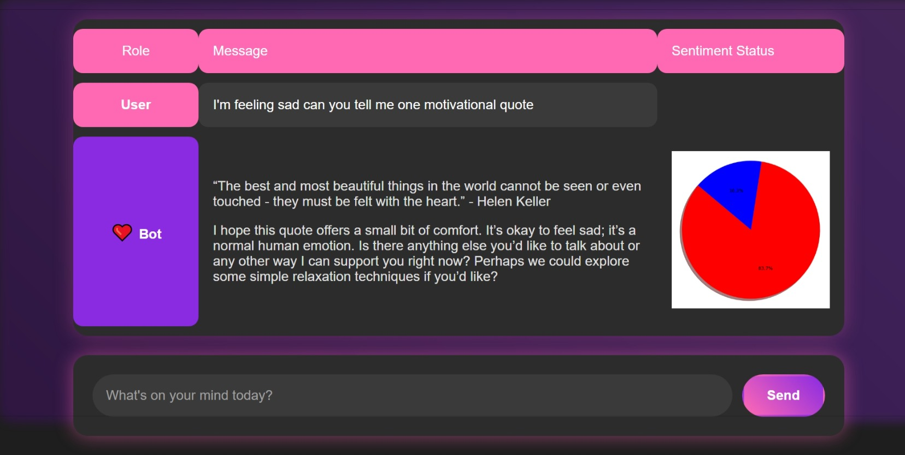

# Mental Health Therapy Chatbot

A mental health therapy chatbot that uses **Google's Gemini** and **Hugging Face Transformers** for sentiment analysis and mental health support. The app provides personalized responses to user queries and visualizes sentiment score in the form of pie charts to assess emotional states.

## Features
- **Sentiment Analysis**: Uses Hugging Face's transformer models to analyze the sentiment of user input.
- **Mental Health Assistance**: Interacts with the user and provides emotional support based on predefined guidelines.
- **Emotion Visualization**: Visualizes sentiment analysis results (positive and negative emotions) as pie charts.
- **Crisis Detection**: Flags potential emotional crises based on sentiment score thresholds.

## Technologies Used
- **Flask**: A lightweight web framework for building the web app.
- **Google Generative AI (Gemini)**: For generating responses based on the input provided by the user.
- **Hugging Face Transformers**: For sentiment analysis of user input.
- **Matplotlib**: For generating pie chart visualizations of sentiment.
- **Markdown**: For rendering Markdown responses in the chat.

---
## Installation

### Prerequisites
Ensure you have Python 3.7 or higher installed.

### 1. Clone the repository:
```bash
git clone https://github.com/RohitMugalya/Mental-Health-Therapy-Chatbot.git
cd Mental-Health-Therapy-Chatbot
```

### 2. **Create and activate virtual environment**
   ```
   python -m venv venv
   ```
- on Linux system
```
source venv/bin/activate
 ```
  - on Windows system
  ```
  .\venv\Scripts\activate.bat
  ```
### 3. Install dependencies:
```bash
pip install -r requirements.txt
```

### 4. Set up Google API
To use **Google Generative AI (Gemini)**, you'll need an API key. Create a project in the [Google AI Studio](https://aistudio.google.com/), enable the Generative AI API, and obtain an API key.

1. Copy your API key and place it in the `bot.py` file as shown:
   ```python
   API_KEY = "your-api-key"
   ```

### 5. Run the Flask App
```bash
python app.py
```

The application will run locally on `http://127.0.0.1:5000/`.

## Usage

1. Open your browser and go to `http://127.0.0.1:5000/`.
2. Enter a query in the provided text box and submit.

3. The chatbot will analyze the sentiment of your input and provide a response.
4. The sentiment results will be displayed as a pie chart showing the distribution of positive and negative emotions.
5. If the sentiment analysis indicates a potential crisis (based on the defined threshold), it will redirect to a crisis page.


---
## Contributing

Feel free to fork the repository, make improvements, or open an issue if you find any bugs or have suggestions for enhancements.

---
### Until next time
*Happy Coding :)*